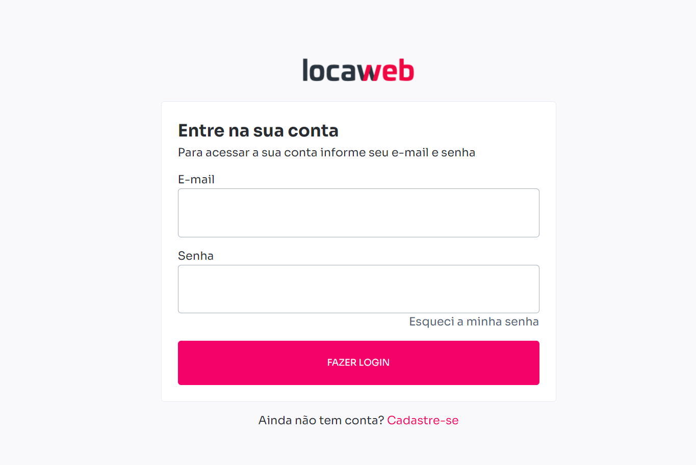

# Desafio Adoorei

## Sobre o desafio

Achei o desafio interessante, muitas boas ideias ainda podem ser aplicadas. Mesmo com o término do processo ainda pretendo implementar mais coisas neste projeto, para fins didáticos e para melhorar a prática no Vue.js.

## O que foi realizado

- Uso do Pinia para salvar estados, utilizado para salvar o plano selecionado e o usuário registrado.
- CSS puro com responsividade.
- Chamada de API para login e registro de usuário.
- Vue Router 4 para administração de rotas, usuário só pode acessar a página de Home quando estiver logado (token no localstorage).
- Inserção do vídeo na página home (responsivo, é possível redimensionar sem uso de pacotes externos).

## O que ainda pode ser feito, melhorias e ideias

- Login e Logout dentro do estado utilizando o Pinia, desacoplar função de login dos componentes.
- Melhorar responsividade para usuário ver apenas o necessário do plano.
- Tornar botão um componente reutilizável, com diferentes estilos com base na sua rota.
- Tornar formulário (ou parte dele) um componente reutilizável.
- Uso de variáveis de ambiente para acessar API.
- Uso de uma camada de serviço para chamar funções de API.
- Melhor uso do Navigation Guards para facilitar a inserção de novas páginas a medida que a aplicação cresce (escalabilidade).
- Uso de animações e transitions básicos para os botões ao fazer chamadas de API ou para demais chamadas assíncronas.
- Aplicar validação ao preencher formulários e indicar o usuários os campos incorretos, talvez uso do Vue Formulate ou VueForm.
- Deploy e aplicação de testes para componentes essenciais.
